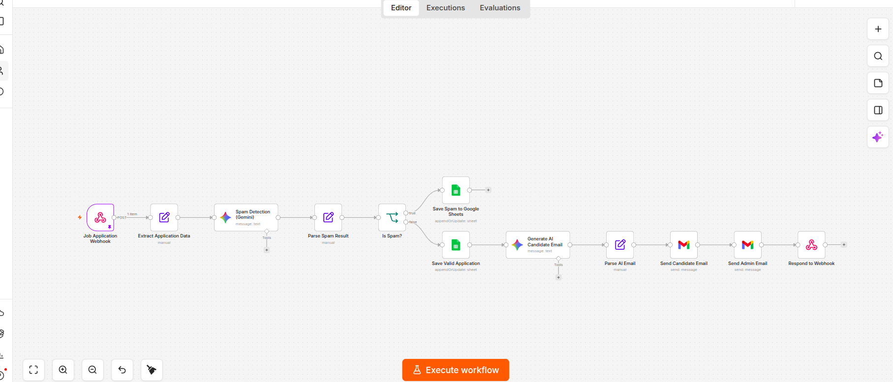
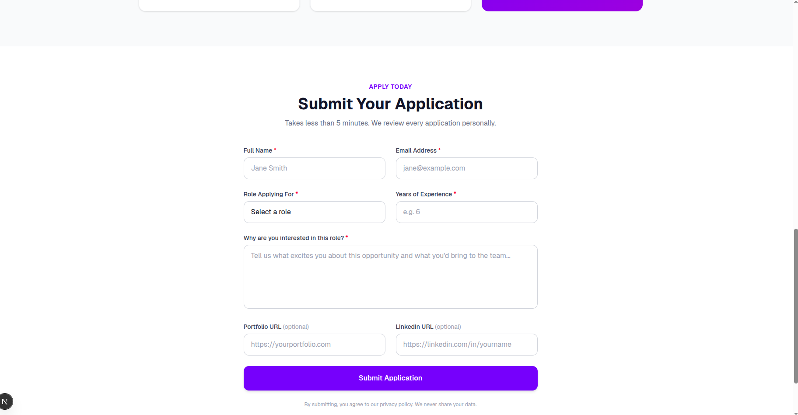
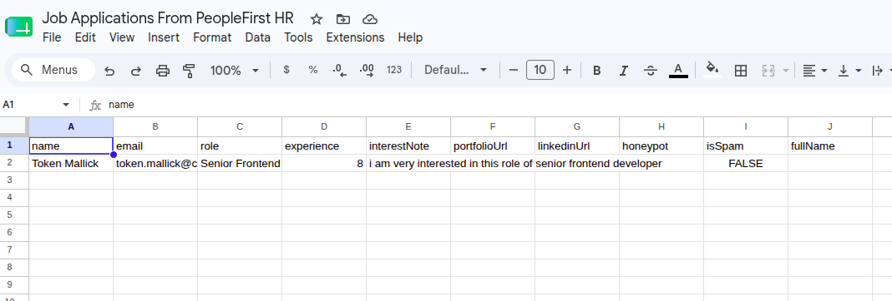
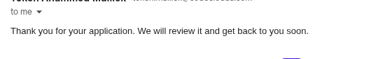
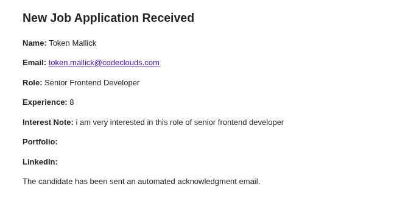

# PeopleFirst HR — AI Hiring Automation

A demo-ready job application platform built with **Next.js 15**, **TypeScript**, and **Tailwind CSS**. Candidates submit applications via a landing page; an **n8n** automation workflow handles spam filtering, Google Sheets storage, and AI-powered email delivery.

---

## Features

### Frontend
- Modern SaaS landing page — Hero, Job Details, Application Form
- Form built with **React Hook Form** + **Zod** validation
- Honeypot field for bot detection
- Loading / success / error UI states
- Fully responsive and keyboard accessible

### API Route (`/api/application`)
- Re-validates all fields server-side
- Sanitizes input (strips HTML/scripts)
- Rate limiting — 3 submissions per IP per minute
- Honeypot check — silently discards bots
- Forwards clean payload to n8n webhook

### n8n Workflow (external — you configure)
- Receives form payload via webhook
- AI spam detection (Gemini / OpenAI)
- Saves valid applications to **Google Sheets** (Sheet 1)
- Saves spam applications to **Google Sheets** (Sheet 2)
- Generates personalized AI acknowledgment email → sends to candidate
- Generates structured HR summary email → sends to admin inbox

---

## Tech Stack

| Layer | Technology |
|-------|-----------|
| Frontend | Next.js 15, TypeScript, Tailwind CSS |
| Form | React Hook Form, Zod |
| Automation | n8n (self-hosted or cloud) |
| AI | Gemini API / OpenAI (configured in n8n) |
| Storage | Google Sheets (via n8n) |
| Email | Gmail SMTP / Brevo / Mailtrap (via n8n) |
| Hosting | Vercel |

---

## Project Structure

```
peoplefirst-hr/
├── app/
│   ├── api/
│   │   └── application/
│   │       └── route.ts        # POST handler — validates + forwards to n8n
│   ├── globals.css
│   ├── layout.tsx
│   └── page.tsx                # Landing page
├── components/
│   ├── HeroSection.tsx         # Hero + stats
│   ├── JobDetailsSection.tsx   # Job card (requirements, perks)
│   └── ApplicationForm.tsx     # Form with validation + states
├── lib/
│   ├── validation.ts           # Zod schema + sanitizer
│   └── googleSheets.ts         # Google Sheets helper (unused — handled by n8n)
├── types/
│   └── application.ts          # TypeScript interfaces
├── .env.local.example
└── README.md
```

---

## Application Form Fields

| Field | Type | Required |
|-------|------|----------|
| Full Name | text | Yes |
| Email | email | Yes |
| Role Applying For | select | Yes |
| Years of Experience | number | Yes |
| Why are you interested? | textarea | Yes (min 10 chars) |
| Portfolio URL | url | No |
| LinkedIn URL | url | No |

---

## Data Flow

```
Candidate fills form
        ↓
POST /api/application (Next.js)
        ↓
Validate → Sanitize → Rate limit → Honeypot check
        ↓
POST to N8N_WEBHOOK_URL
        ↓
n8n Workflow:
  ├── Spam Detection (AI)
  │     ├── SPAM  → Save to "Spam Applications" sheet → stop
  │     └── VALID → Save to "Valid Applications" sheet
  │                       ↓
  │               Generate AI candidate email
  │                       ↓
  │               Send email to candidate
  │                       ↓
  │               Generate HR summary
  │                       ↓
  │               Send email to admin
  └── Return { success: true }
        ↓
Form shows success message
```

---

## Setup

### 1. Install Dependencies

```bash
npm install
```

### 2. Configure Environment

```bash
cp .env.local.example .env.local
```

Edit `.env.local`:

```env
N8N_WEBHOOK_URL=https://your-n8n.app.n8n.cloud/webhook/job-application
```

### 3. Run Development Server

```bash
npm run dev
```

Open [http://localhost:3000](http://localhost:3000)

---

## n8n Workflow Setup

### Webhook URL Types

| URL Pattern | When active |
|-------------|-------------|
| `/webhook-test/job-application` | Only when workflow open in editor + "Listen for test event" clicked |
| `/webhook/job-application` | When workflow is **activated** (toggle ON) |

Use `/webhook-test/` during development, switch to `/webhook/` for demo/production.

### Workflow Nodes

| # | Node | Purpose |
|---|------|---------|
| 1 | Webhook | Receive POST payload from Next.js |
| 2 | Set | Normalize field names |
| 3 | AI (Gemini/OpenAI) | Spam classification → returns `{ isSpam, reason }` |
| 4 | IF | Branch on `isSpam` |
| 5A | Google Sheets Append | Spam path — append to "Spam Applications" |
| 5B | Google Sheets Append | Valid path — append to "Valid Applications" |
| 6 | AI | Generate personalized candidate email |
| 7 | AI | Generate structured HR summary |
| 8 | Gmail/SMTP | Send acknowledgment to candidate |
| 9 | Gmail/SMTP | Send summary to admin |
| 10 | Respond to Webhook | Return `{ success: true }` |

### Google Sheets Structure

**Sheet 1 — Valid Applications**

| Timestamp | Name | Email | Role | Experience | Interest Note | Portfolio | LinkedIn | AI Summary | Status |
|-----------|------|-------|------|------------|---------------|-----------|----------|------------|--------|

**Sheet 2 — Spam Applications**

| Timestamp | Name | Email | Reason | Raw Payload |
|-----------|------|-------|--------|-------------|

### AI Spam Detection Prompt

```text
You are a spam detection system.

Analyze this job application and return ONLY valid JSON:
{
  "isSpam": true/false,
  "reason": "short reason"
}

Application:
Name: {{ $json.fullName }}
Email: {{ $json.email }}
Message: {{ $json.interestNote }}
```

### AI Candidate Email Prompt

```text
You are an HR recruiter at PeopleFirst HR.

Write a warm, professional, encouraging acknowledgment email.

Candidate:
Name: {{ $json.fullName }}
Role: {{ $json.role }}
Experience: {{ $json.experience }} years
Reason for applying: {{ $json.interestNote }}

Rules:
- Keep under 200 words
- Sound human, not robotic
- Mention the candidate's experience
- Mention the role name
- Thank them genuinely
```

---

## Environment Variables

| Variable | Required | Description |
|----------|----------|-------------|
| `N8N_WEBHOOK_URL` | Yes | Full n8n webhook URL for the job-application workflow |

---

## Production Checklist

1. **Security** — Add CAPTCHA, stronger rate limiting, API key auth on webhook
2. **Infrastructure** — Switch n8n to production webhook URL (`/webhook/`), set up retry/queue
3. **Compliance** — GDPR consent checkbox, data retention policy, resume upload support

---

## Scripts

```bash
npm run dev      # Start dev server (localhost:3000)
npm run build    # Production build
npm run start    # Start production server
npm run lint     # ESLint
```

WorkFlow Details: 
This workflow is designed to automate the process of receiving, analyzing, and responding to job applications efficiently.

1. Job Application Webhook: The workflow starts with a POST request to a webhook URL. This request contains the job application data.

2. Extract Application Data: The data from the webhook is parsed to extract key details like the applicant's name, email, role, experience, interest note, portfolio URL, and LinkedIn URL.

3. Spam Detection (Gemini): The extracted data is sent to the Gemini model to analyze whether the application email is spam or valid based on various criteria.

4. Parse Spam Result: The result from the spam detection step is checked. If marked as spam, the isSpam flag is set to true.

5. Is Spam?: The workflow uses a conditional node to check the isSpam flag.

5. i. If Spam: The information is saved to a specified Google Sheets document under "Sheet1" labeled as spam.

5. ii. If Not Spam: Valid applications are saved to another sheet in the same document.

6. Generate AI Candidate Email: For valid applications, an AI-generated acknowledgment email is composed for the applicant.

7. Parse AI Email: The text for the email body is prepared and formatted properly before sending.

8. Send Candidate Email: The prepared email is sent to the applicant using Gmail.

9. Send Admin Email: An email notification is sent to an admin's email address, summarizing the received application details.

10. Respond to Webhook: Finally, the workflow sends a JSON response back to confirm the successful receipt of the application.

Workflow screenshot:


UI Screenshot


Output
Storing data into google sheet

User is getting email generated by Gemini flash

Admin is getting emai
